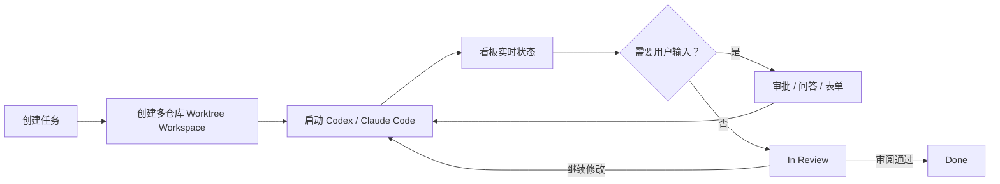

# Agents-Workspaces P0 产品规划

## 产品目标

Agents-Workspaces 是一个运行在 macOS 本机的多 Agent 开发控制台。它将跨多个 Git 仓库的需求组织成隔离 Workspace，在 Native 或本机 Docker 中运行 Codex 和 Claude Code，并通过统一看板处理状态、审批、问答和代码审阅。

P0 只支持：

- OpenAI Codex；
- Anthropic Claude Code。

## 核心闭环

## 看板状态

| 状态 | 定义 |
|---|---|
| To Do | 任务已创建、尚未运行 |
| In Progress | 至少一个 Agent 正在执行 |
| Needs Attention | 存在等待用户处理的审批或问题 |
| In Review | 本轮执行完成，等待代码审阅 |
| Done | 用户确认完成 |
| Cancelled | 任务被取消 |

聚合优先级为：待处理交互 > 运行中 Session > 等待 Review > 终态。

## P0 功能

### 项目、仓库和 Workspace

- 创建项目并登记多个本地 Git 仓库；
- 设置仓库基线分支；
- 为一个任务选择多个仓库；
- 自动创建统一任务分支和 Git Worktree；
- 聚合到一个 Workspace 根目录；
- 多个任务并行且互不覆盖；
- 清理前检测未提交变更，不静默删除分支。

### Agent

- 启动 Codex 或 Claude Code；
- Native 与 Docker 两种执行方式；
- 一个任务可包含多个 Agent Session；
- 发送继续指令、中断和终止；
- 保存 Provider Session ID；
- Gateway 重启后将中断会话标为失败并保留恢复信息。

### 双向交互

- 命令审批；
- 文件修改审批；
- 网络和文件系统权限；
- Claude Code `AskUserQuestion`；
- Codex `requestUserInput`；
- MCP Elicitation 表单；
- 允许、当前会话允许、拒绝、取消；
- 用户在 Web 看板提交后恢复原 Agent 调用。

### Review

- 按仓库显示 Git status、diff、diff stat 和任务分支提交；
- 展示 Agent Session 总结和异常；
- 支持继续修改、通过并完成、取消；
- Task 完成后可保存 Obsidian 知识候选。

### 本地知识库

- 配置本地 Obsidian Vault；
- 选择全局、项目、仓库和任务级 Markdown；
- 为 Workspace 生成 AGENTS.md 和 CLAUDE.md；
- 保存来源 hash 和编译清单；
- Agent 结论只进入候选 Inbox，不自动成为正式 Memory。

## P0 安全边界

- Web/API 只允许 loopback 客户端访问；Daemon 监听本机接口以接收 Docker Desktop 回调；
- Claude HTTP Hook 使用每次启动生成的 Bearer Token；
- Codex 默认 `workspace-write + on-request`；
- Claude Code 默认 `manual` 权限模式；
- Docker 不使用 privileged，不挂载 Docker Socket；
- 每次容器运行只挂载当前 Workspace 和当前 Provider 的凭证卷；
- Provider Token 不进入 SQLite、Workspace 或 Obsidian；
- 强制清理必须由用户显式触发。

## P0 非目标

- 云服务器 Runner；
- 多设备同步；
- Obsidian 云备份；
- 多用户与 RBAC；
- GitHub PR 自动合并；
- Codex、Claude Code 之外的 Agent；
- 公网 SaaS。

## 完成定义

Codex 与 Claude Code 必须分别完成以下端到端用例才算 P0 完成：

1. 创建多仓库 Workspace；
2. 启动 Agent；
3. 看板收到审批或问题；
4. 用户从看板回答；
5. 原会话继续；
6. Agent 完成本轮并进入 In Review；
7. 用户继续修改或确认 Done。
