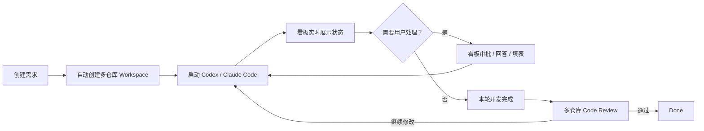
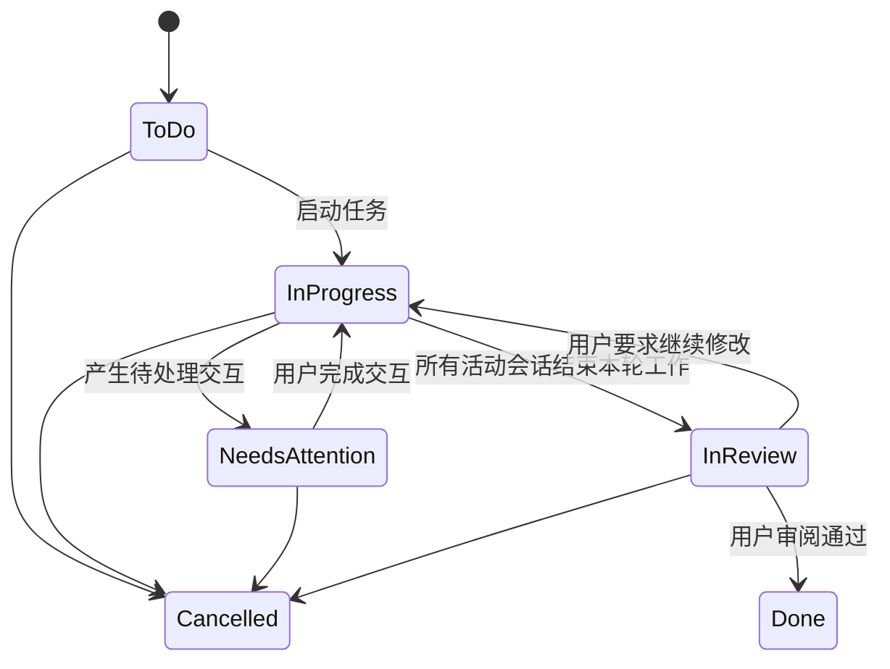

# AgentBoard P0 产品规划

> 文档状态：初稿
> 产品范围：macOS 本机，支持 Codex 与 Claude Code
> 核心目标：多 Agent 并行管理、多仓库隔离 Workspace、看板双向交互

## 1. 产品定义

AgentBoard 是一个面向个人开发者的本地多 Agent 开发控制台。它负责把一个跨多个 Git 仓库的需求组织成独立 Workspace，在本机或本机 Docker 中启动 Codex、Claude Code，并把 Agent 的运行状态、审批请求、用户问题和代码审阅统一汇聚到一个 Web 看板。

P0 只支持两个 Agent：

- OpenAI Codex
- Anthropic Claude Code

P0 不追求构建通用 Agent 平台，而是优先打通这两个工具的高质量原生集成。

## 2. P0 要解决的问题

### 2.1 多 Agent 并行缺乏统一视图

用户可能同时运行多个 Codex 或 Claude Code 会话。现有方式需要在多个终端之间切换，难以快速判断：

- 哪些任务正在执行；
- 哪些任务被问题或权限审批阻塞；
- 哪些任务已经完成编码、等待 Code Review；
- 每个任务修改了哪些仓库；
- 哪些任务已经完成或取消。

### 2.2 跨仓库需求创建环境过慢

一个需求可能同时修改 Web、桌面客户端和多个后端仓库。手动复制、拉分支和组合目录速度慢，而且多个并行需求容易互相影响。

### 2.3 Agent 的交互被困在终端

Agent 经常需要用户：

- 批准命令；
- 批准文件修改或删除；
- 授予网络、文件系统等权限；
- 回答澄清问题；
- 从多个方案中选择；
- 填写结构化表单。

这些交互必须进入统一看板，用户在看板完成操作后，答案需要回到原 Agent 会话并继续运行。

### 2.4 全局策略和项目知识分散

全局开发规范、项目架构、仓库说明和历史决策需要有唯一、可审阅的维护位置，并能在创建 Workspace 时自动转换成 Codex 和 Claude Code 所需的上下文。

## 3. P0 成功标准

P0 成功不是“能启动一个 CLI”，而是完成下面这条闭环：



核心量化验收：

1. 一个项目可以配置至少四个 Git 仓库。
2. 一个需求可以自动创建所有仓库的独立 Worktree 和任务分支。
3. 至少两个需求可以同时运行且目录、分支互不干扰。
4. 同一需求可以运行一个或多个 Codex/Claude Code 会话。
5. Agent 请求用户交互后，看板能够实时进入 `Needs Attention`。
6. 用户在看板提交决定后，原会话能够继续运行。
7. Agent 完成本轮工作后自动进入 `In Review`，不能直接视为 `Done`。
8. Review 页面可以按仓库查看 diff、测试结果和 Agent 总结。
9. Native 与 Docker 两种执行模式都可用。
10. 本地 Obsidian 文档可以被编译进任务上下文。

## 4. P0 用户模型

P0 为单机、单用户产品：

- 只支持 macOS；
- 用户在本机启动 AgentBoard；
- 浏览器访问本地 Web UI；
- 不设计账号体系、团队、角色或 RBAC；
- 不开放公网访问；
- 所有元数据默认保存在本机 SQLite；
- 所有代码和 Obsidian 文档留在本机。

## 5. 核心概念

| 概念 | 定义 |
|---|---|
| Project | 一个业务项目，包含一个或多个仓库 |
| Repository | Project 下的 Git 仓库及其默认分支配置 |
| Task | 看板中的一条开发需求 |
| Workspace | 为某个 Task 创建的多仓库隔离工作区 |
| Agent Session | 一次 Codex 或 Claude Code 会话 |
| Execution Profile | Native 或 Docker 执行配置 |
| Interaction | 等待用户处理的审批、问题或表单 |
| Change Set | 某个 Workspace 中各仓库的代码变化集合 |
| Knowledge Source | 本次任务引用的 Obsidian 知识文档 |

一个 Task 可以包含多个 Agent Session，但所有会话共享同一个 Task Workspace。默认建议一个会话负责一组边界清晰的仓库或子任务，避免两个 Agent 同时编辑同一文件。

## 6. 看板与状态机

P0 使用六列：

| 状态 | 含义 | 是否需要用户立即处理 |
|---|---|---:|
| To Do | 任务已创建，尚未启动 | 否 |
| In Progress | 至少一个 Agent 正在工作 | 否 |
| Needs Attention | Agent 等待审批、回答或表单 | 是 |
| In Review | 本轮开发结束，等待代码审阅 | 是，但不阻塞运行进程 |
| Done | 用户确认完成 | 否 |
| Cancelled | 任务取消 | 否 |



当一个 Task 有多个 Session 时，任务状态按以下优先级聚合：

```text
存在待处理 Interaction > 存在运行中 Session > 等待 Review > Done/Cancelled
```

## 7. P0 功能范围

### 7.1 项目与仓库管理

- 创建、编辑、归档 Project；
- 添加本地仓库或 Git Remote；
- 配置默认基线分支；
- 检查仓库状态、Remote 和 Git 可用性；
- 设置 Workspace 根目录；
- 定义项目常用仓库组合。

### 7.2 Task 与 Workspace

- 创建 Task，填写标题和需求描述；
- 选择参与本次需求的仓库；
- 为每个仓库创建统一命名的任务分支；
- 通过 Git Worktree 聚合到一个 Workspace；
- 支持已有分支、全新分支两种模式；
- Workspace 创建失败时回滚已经创建的 Worktree；
- 清理前展示未提交修改、未推送提交和分支状态；
- 不允许静默删除原始仓库或未合并分支。

### 7.3 Agent 启动与会话管理

- Agent 类型只允许 Codex、Claude Code；
- 选择 Native 或 Docker Execution Profile；
- 输入初始任务提示；
- 启动、继续、打断和终止会话；
- 实时显示 Agent 消息、工具活动和运行日志；
- 保存 Provider Session ID，用于支持的会话恢复；
- 一个 Task 可新建多个 Session；
- 标记每个 Session 负责的仓库和子任务。

### 7.4 双向用户交互

统一支持：

- 命令执行审批；
- 文件变更审批；
- 文件系统和网络权限申请；
- 删除操作确认；
- 单选、多选；
- 单行文本、多行文本；
- JSON Schema/结构化表单；
- 拒绝并附带原因；
- 允许一次；
- 在 Provider 支持时允许本会话。

每个 Interaction 必须展示：

- 来自哪个 Task、Agent 和 Session；
- 请求原因；
- 命令、工作目录或文件变化；
- 风险等级；
- 可用决策；
- 创建时间和是否已经失效。

### 7.5 Code Review

- 按仓库列出新增、修改、删除文件；
- 展示 diff；
- 展示未提交和已提交变化；
- 展示测试、Lint、构建结果；
- 展示 Agent 完成总结；
- 支持“通过”“继续修改”“取消任务”；
- 继续修改时可以追加指令并恢复原 Session，或创建新 Session。

### 7.6 Native 与 Docker

Native：

- 在宿主机 Workspace 目录启动 CLI；
- 使用宿主机 Git、Node 和已有登录状态；
- 展示可执行文件和版本检查结果。

Docker：

- Worktree 由宿主机创建并挂载到 `/workspace`；
- 容器使用非 root 用户；
- 不挂载整个用户主目录；
- 不挂载 Docker Socket；
- Codex 与 Claude Code 使用彼此独立的持久凭证卷；
- 一个 Execution Profile 指定镜像、环境变量白名单、端口和初始化命令。

### 7.7 本地 Obsidian 知识库

- 用户配置本地 Vault 路径；
- 选择全局、项目、仓库、任务级 Markdown；
- 创建 Workspace 时编译运行时上下文；
- 为 Codex 生成 AGENTS.md 或对应运行配置；
- 为 Claude Code 生成 CLAUDE.md、`.claude`/Hooks/MCP 配置；
- 不自动覆盖仓库已有规则，冲突时展示来源与优先级；
- 任务完成后允许保存“知识候选”到 Inbox；
- P0 不自动把 Agent 推断写入正式知识。

### 7.8 通知

- `Needs Attention` 时发送 macOS 通知；
- 所有 Session 结束本轮工作时发送通知；
- Agent 异常退出时发送通知；
- 看板展示待处理数量；
- P0 不发送邮件、短信、Slack 或移动端推送。

## 8. 默认安全策略

P0 不把“运行在 Docker 中”等同于“可以完全跳过审批”。默认采用 Balanced 策略：

- Workspace 内普通读写按 Provider 能力和配置执行；
- 高风险命令、额外目录访问、网络权限和外部副作用进入审批；
- `git push`、强制推送、发布、删除大量文件等默认询问；
- 禁止访问未显式挂载的宿主机目录；
- 不在数据库中明文复制 Provider Token；
- Gateway 只保存凭证位置和 Execution Profile 引用；
- 所有用户决定写入本地审计事件。

## 9. P0 非目标

- 不支持 Codex、Claude Code 之外的 Agent；
- 不构建 IDE；
- 不替代 GitHub/GitLab；
- 不在 P0 中自动合并、推送或发布；
- 不保证所有 Provider 的内部事件完全一致；
- 不通过脆弱的终端文字解析实现主要审批链路；
- 不做云端凭证同步；
- 不做 Obsidian 图谱算法或自动知识推理平台。

## 10. P0 交付拆分

### P0-A：控制台骨架

本地 CLI、Daemon、SQLite、Web 看板、WebSocket 和基础 Task 管理。

### P0-B：多仓库 Workspace

Repository、分支、Worktree、聚合目录、状态检查和安全清理。

### P0-C：Codex 完整闭环

App Server、会话事件、审批、用户问题、表单、恢复和 Review 状态。

### P0-D：Docker Executor

镜像、容器生命周期、Workspace 挂载、凭证卷和安全默认值。

### P0-E：Claude Code 完整闭环

流式 CLI、PermissionRequest、Elicitation、MCP 交互桥、生命周期 Hooks 和会话恢复。

### P0-F：知识与审阅

Obsidian Context Compiler、多仓库 diff、测试结果、知识候选和 macOS 通知。

## 11. P0 完成定义

只有当 Codex 与 Claude Code 都完成以下闭环，P0 才算完成：

```text
创建 Workspace
→ 启动 Agent
→ 实时更新看板
→ 看板处理审批/问题
→ 原会话继续
→ 本轮完成进入 In Review
→ 用户要求修改或确认 Done
```

任何一个 Provider 只能启动但不能完成双向交互，都不视为“已支持”。
