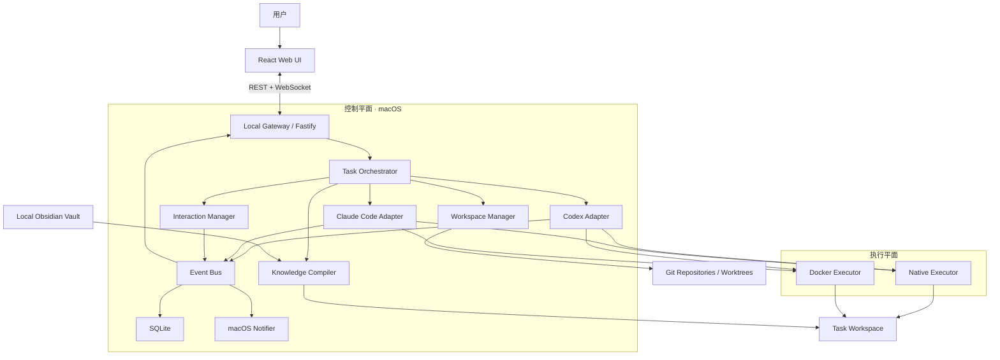
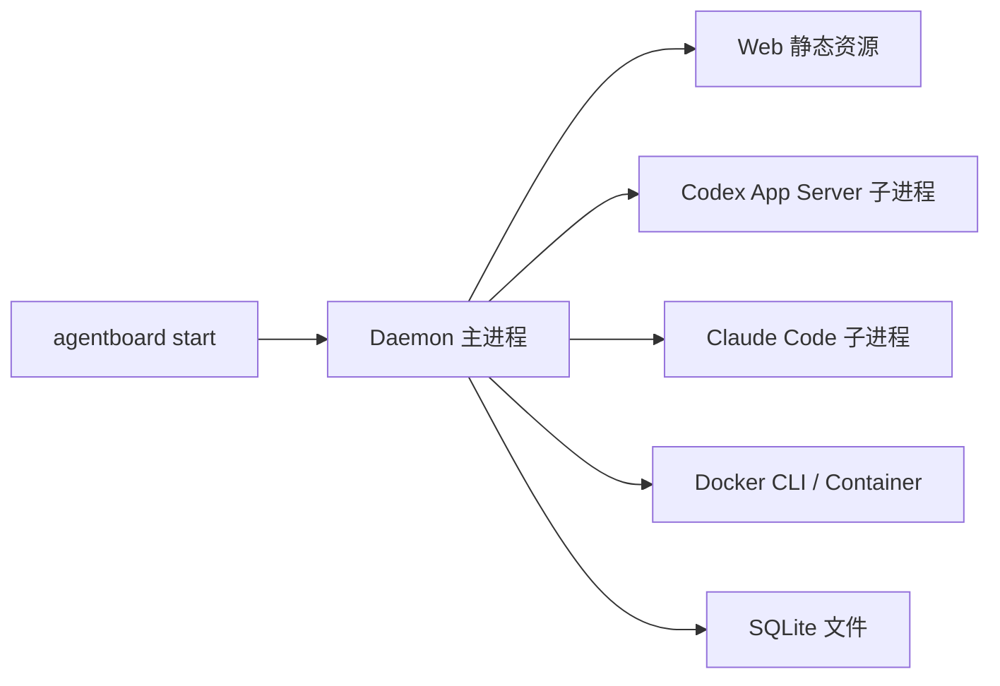
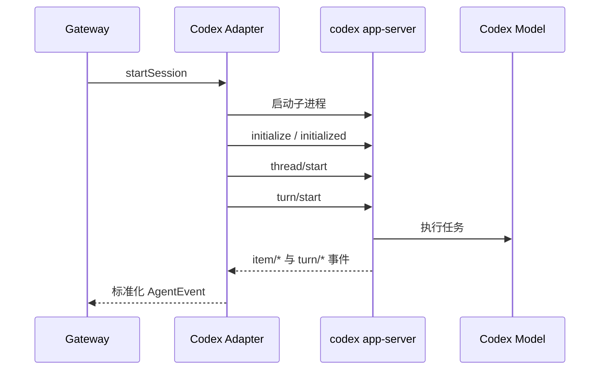
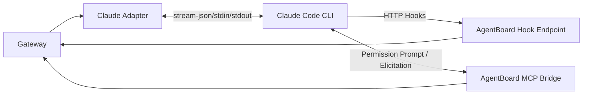
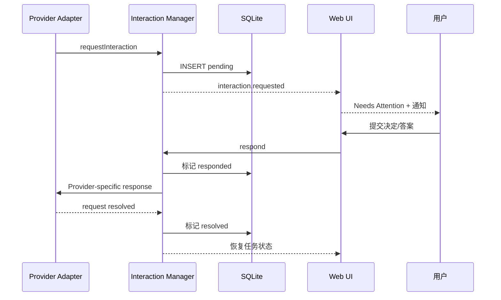
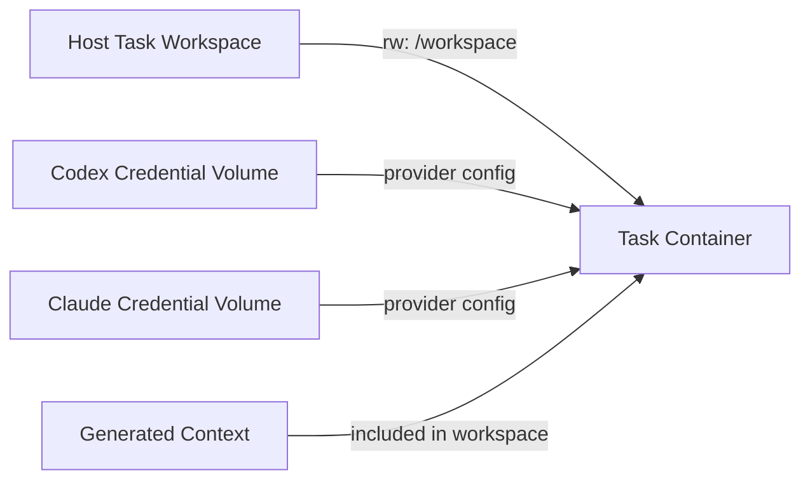
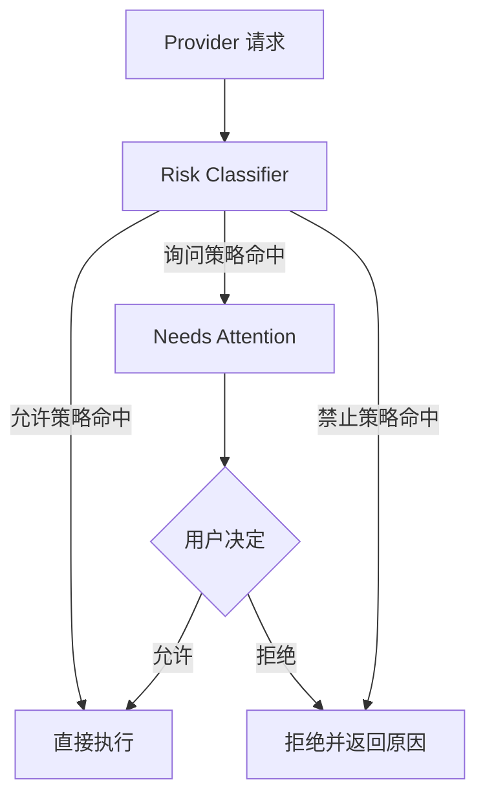

# AgentBoard P0 技术方案

> 技术栈：Node.js + TypeScript
> 平台：macOS
> Agent：Codex、Claude Code
> 执行环境：Native、本机 Docker

## 1. 技术目标

P0 技术方案需要实现四条主链路：

1. 多仓库 Git Worktree 自动组合成隔离 Workspace；
2. Codex 与 Claude Code 会话被统一启动、观察和控制；
3. Agent 审批、提问和表单进入 Web 看板，并能回到原会话；
4. 本地 Obsidian 文档被编译成可追溯的运行时上下文。

技术上采用“统一领域模型 + Provider 专用 Adapter”，不强行让两个 Agent 使用相同的底层协议。

## 2. 总体架构



## 3. 推荐工程结构

```text
agentboard/
├── apps/
│   ├── cli/                       # agentboard start 等命令
│   ├── daemon/                    # 本地 Gateway
│   └── web/                       # React 看板
├── packages/
│   ├── core/                      # 领域模型、状态机、错误码
│   ├── database/                  # SQLite、Migration、Repository
│   ├── event-bus/                 # 内部事件与 WebSocket 广播
│   ├── workspace-manager/         # Git/Worktree
│   ├── executor-core/             # Executor 接口
│   ├── executor-native/
│   ├── executor-docker/
│   ├── agent-core/                # Agent Adapter 接口
│   ├── agent-codex/
│   ├── agent-claude/
│   ├── interaction-manager/
│   ├── knowledge-compiler/
│   └── shared-ui/
├── docker/
│   ├── base/
│   └── profiles/
├── docs/
└── pnpm-workspace.yaml
```

推荐依赖：

| 领域 | 选择 |
|---|---|
| Runtime | Node.js LTS、TypeScript |
| Monorepo | pnpm workspace |
| HTTP | Fastify |
| UI | React、Vite |
| 数据库 | SQLite、Drizzle ORM |
| 校验 | Zod |
| 实时通信 | WebSocket |
| 日志 | Pino |
| Git | 调用系统 Git CLI |
| Docker | 调用 Docker CLI，后续可替换 Engine API |
| 终端降级 | node-pty，仅用于兼容和日志终端 |

P0 使用 Web UI，不先引入 Electron。Daemon 启动后自动输出本地访问地址，可选择打开默认浏览器。

## 4. 进程模型



Daemon 是唯一状态写入者。Web UI 不直接操作 Git、Docker 或 Agent 进程，所有改变都通过 API 转换成命令和领域事件。

P0 不拆分微服务，使用模块化单体，降低本机部署和升级复杂度。

## 5. 领域接口

### 5.1 Agent Adapter

```ts
export interface AgentAdapter {
  readonly provider: "codex" | "claude";

  checkInstallation(profile: ExecutionProfile): Promise<AgentCapability>;
  start(input: StartSessionInput): Promise<AgentSessionHandle>;
  resume(input: ResumeSessionInput): Promise<AgentSessionHandle>;
  sendMessage(sessionId: string, message: AgentMessageInput): Promise<void>;
  interrupt(sessionId: string): Promise<void>;
  terminate(sessionId: string): Promise<void>;
  respondToInteraction(
    sessionId: string,
    interactionId: string,
    response: InteractionResponse,
  ): Promise<void>;
  subscribe(sessionId: string, sink: AgentEventSink): Unsubscribe;
}
```

### 5.2 Executor

```ts
export interface Executor {
  readonly type: "native" | "docker";

  prepare(input: PrepareExecutionInput): Promise<ExecutionHandle>;
  spawn(input: SpawnInput): Promise<ProcessHandle>;
  writeStdin(processId: string, data: Uint8Array): Promise<void>;
  signal(processId: string, signal: ExecutionSignal): Promise<void>;
  inspect(executionId: string): Promise<ExecutionStatus>;
  dispose(executionId: string): Promise<void>;
}
```

Agent Adapter 不关心进程在宿主机还是容器中。它通过 Executor 获取 stdio、退出状态和运行目录。

## 6. Codex Adapter

### 6.1 主通道

P0 使用 Codex App Server 的 stdio JSON-RPC 通道，不以普通 TUI 文本解析作为主要控制方式。



需要实现的协议映射：

| Codex 事件/方法 | AgentBoard 语义 |
|---|---|
| `thread/start` | 创建 Session |
| `thread/resume` | 恢复 Session |
| `turn/start` | 开始一轮执行 |
| `turn/steer` | 向运行中的会话追加指令 |
| `turn/interrupt` | 中断本轮 |
| `item/started`、`item/completed` | 工具/文件/命令活动 |
| `item/commandExecution/requestApproval` | 命令审批 |
| `item/fileChange/requestApproval` | 文件变更审批 |
| `item/permissions/requestApproval` | 文件系统/网络权限 |
| `item/tool/requestUserInput` | 短问题和选项 |
| `mcpServer/elicitation/request` | 结构化表单 |
| `turn/completed` | 本轮完成或失败 |

App Server 的请求包含 threadId、turnId 和 item/request ID。Adapter 必须完整保存映射，确保回复发给正确会话。

### 6.2 Codex 登录

- Native 模式使用本机已经登录的 Codex 配置；
- Docker 模式使用单独命名卷保存 Codex 配置；
- 第一次使用 Docker Profile 时，在该容器/凭证卷中完成一次登录；
- AgentBoard 不解析、不复制和不写入 Token；
- 登录状态检查作为 Profile Health Check 展示。

使用 App Server 不等于调用 Codex API，它是 Codex 客户端的宿主集成接口，继续复用 Codex 自身的登录和订阅权益。

## 7. Claude Code Adapter

### 7.1 主通道组合

Claude Code P0 使用“流式 CLI + Hooks + MCP Bridge”的组合：



职责划分：

| 通道 | 职责 |
|---|---|
| stream-json | 会话输出、消息流和基础运行状态 |
| PermissionRequest Hook | 权限请求的结构化捕获和 allow/deny 返回 |
| Elicitation Hook/MCP | 用户问题和结构化表单 |
| Stop/SessionEnd Hook | 本轮停止和会话结束 |
| MCP Permission Prompt Tool | 非交互模式下将权限问题路由到 AgentBoard |

Claude Code Adapter 必须避免通过匹配“Do you want to proceed?”等终端文案判断审批。

### 7.2 等待用户的处理

Hook 或 MCP Bridge 收到请求后：

1. 创建 Interaction；
2. 将 Provider 请求上下文与 Interaction ID 关联；
3. 等待 Gateway 返回用户决定；
4. 输出 Claude Code 规定的结构化结果；
5. Claude Code 恢复执行。

若 Provider 或 Hook 存在等待时限，则采用以下策略之一：

- 使用 Claude Code 支持的 defer/恢复机制保存调用；
- 结束当前进程但保留 Session ID 和待处理上下文；
- 用户回答后恢复该 Session 并回放结构化结果。

P0 验收必须覆盖“用户等待数分钟后再回答”，不能只验证立即点击。

### 7.3 Claude Code 登录

- Native 模式复用本机 Claude Code 登录；
- Docker 使用 Claude 专用持久卷；
- 不与 Codex 共用凭证卷；
- 第一次使用某 Docker Profile 时完成一次登录；
- 远程凭证迁移不属于 P0。

## 8. 统一事件模型

```ts
type AgentEvent =
  | { type: "session.started"; sessionId: string }
  | { type: "turn.started"; sessionId: string; turnId: string }
  | { type: "message.delta"; sessionId: string; text: string }
  | { type: "tool.started"; sessionId: string; tool: ToolActivity }
  | { type: "tool.completed"; sessionId: string; result: ToolResult }
  | { type: "interaction.requested"; request: InteractionRequest }
  | { type: "interaction.resolved"; interactionId: string }
  | { type: "turn.completed"; sessionId: string; summary?: string }
  | { type: "session.failed"; sessionId: string; error: AgentError }
  | { type: "session.ended"; sessionId: string };
```

原始 Provider 事件以 JSON 形式保存用于诊断，但 UI 和任务状态只消费标准化事件。

事件必须带有：

- eventId；
- provider；
- projectId、taskId、workspaceId、sessionId；
- providerThreadId/providerSessionId；
- providerTurnId；
- timestamp；
- schemaVersion。

## 9. Interaction Manager

### 9.1 模型

```ts
interface InteractionRequest {
  id: string;
  provider: "codex" | "claude";
  taskId: string;
  sessionId: string;
  providerRequestId: string;
  kind:
    | "command_approval"
    | "file_approval"
    | "permission_request"
    | "question"
    | "choice"
    | "form";
  title: string;
  message?: string;
  command?: string;
  cwd?: string;
  fileChanges?: FileChange[];
  options?: ChoiceOption[];
  requestedSchema?: JsonSchema;
  availableDecisions: InteractionDecision[];
  riskLevel: "low" | "medium" | "high";
  status: "pending" | "responded" | "resolved" | "stale" | "cancelled";
  createdAt: string;
}
```

### 9.2 处理流程



### 9.3 幂等与失效

- 同一 Provider Request ID 只能创建一个有效 Interaction；
- 重复提交相同答案返回成功；
- 已 resolved/stale 的请求不能再次回传 Provider；
- Turn 结束、被中断或 Session 退出时，未处理请求标记 stale；
- UI 明确显示“该问题已经失效”；
- Gateway 重启后重新检查 Provider 连接，无法恢复的 pending 请求标记“等待恢复会话”。

## 10. Task 状态聚合

Task 状态由事实计算，不由 UI 随意拖动：

```ts
function deriveTaskStatus(task: TaskAggregate): TaskStatus {
  if (task.cancelledAt) return "cancelled";
  if (task.completedAt) return "done";
  if (task.interactions.some((x) => x.status === "pending")) {
    return "needs_attention";
  }
  if (task.sessions.some((x) => x.runtimeStatus === "running")) {
    return "in_progress";
  }
  if (task.hasStarted && task.reviewRequired) return "in_review";
  return "todo";
}
```

允许用户拖动卡片触发领域命令，例如从 In Review 拖回 In Progress 时要求填写继续修改的提示；但不能直接覆盖事实状态。

## 11. Workspace Manager

### 11.1 目录约定

```text
<workspace-root>/
├── .agentboard/
│   ├── workspace.json
│   ├── context-manifest.json
│   ├── generated/
│   └── logs/
├── web/
├── desktop/
├── api-gateway/
└── order-service/
```

### 11.2 创建事务

1. 校验所有 Repository 和 Git 版本；
2. 检查基线分支和未提交状态；
3. fetch 可选更新；
4. 生成 branchName 和 workspacePath；
5. 逐仓库创建 Worktree；
6. 写入 workspace manifest；
7. 编译知识上下文；
8. 标记 Workspace ready。

如果第 5～7 步失败，只清理本次事务新建且确认安全的 Worktree，不删除原仓库、已有分支或用户文件。

### 11.3 并发约束

- 同一仓库的同一分支不能被两个 Worktree 重复占用；
- Workspace 路径全局唯一；
- 创建/清理使用数据库租约锁；
- 默认不允许两个 Agent 声明相同文件写入范围；
- P0 只做冲突提示，不实现强制文件锁。

## 12. Native Executor

Native Executor 使用受控子进程：

- 明确设置 cwd 为 Workspace；
- 环境变量由 Profile 白名单合并；
- 保存 PID、启动时间和退出码；
- stdout/stderr 分流并写入事件；
- 终止顺序为 interrupt → graceful terminate → 用户确认后强制终止；
- 不修改用户 Shell 配置；
- 启动前检查 Codex、Claude Code、Git 和必要工具版本。

## 13. Docker Executor

### 13.1 挂载模型



实际 Profile 中只挂载当前所选 Provider 的凭证卷，不同时把两个凭证暴露给无关 Session。

### 13.2 安全默认值

- 非 root 用户；
- 仅挂载当前 Workspace；
- 不挂载宿主机 SSH、Keychain 和整个 Home；
- 不挂载 Docker Socket；
- 默认禁用 privileged；
- 环境变量使用显式白名单；
- 容器标签记录 taskId/sessionId；
- 停止 Agent 不自动删除 Workspace；
- 清理容器和清理代码是两个独立操作。

### 13.3 macOS 性能取舍

P0 选择宿主机 Worktree bind mount，优点是用户可以直接用 IDE 和 Git 工具 Review。macOS 上 bind mount 性能可能低于 Docker Volume，但 P0 优先保证可见性和简单性；后续可增加“代码位于 Docker Volume、通过同步层访问”的高性能 Profile。

## 14. Knowledge Compiler

### 14.1 来源层级

```text
Global < Project < Repository < Task
```

Context Manifest 记录：

- 源文件绝对路径；
- 文件 hash；
- frontmatter；
- 应用范围；
- 编译时间；
- 目标 Provider；
- 冲突与覆盖结果。

### 14.2 Provider 输出

Codex 输出：

- Workspace 根级 AGENTS.md；
- 必要的 Codex 项目配置；
- AgentBoard MCP 配置；
- 不覆盖仓库内已有更具体的 AGENTS.md。

Claude Code 输出：

- Workspace 根级 CLAUDE.md；
- `.claude` 项目设置；
- AgentBoard Hooks；
- AgentBoard MCP 配置；
- 不覆盖仓库已有配置，采用生成层或合并预览。

生成文件必须带有“由 AgentBoard 生成”的声明，并保存在 manifest 中。用户源文档始终是 Obsidian Markdown，不把生成文件作为权威来源。

## 15. 数据库设计

核心表：

| 表 | 主要字段 |
|---|---|
| projects | id, name, status, created_at |
| repositories | id, project_id, name, local_path, remote_url, base_branch |
| tasks | id, project_id, title, description, status facts |
| workspaces | id, task_id, path, status, manifest |
| workspace_repositories | workspace_id, repository_id, branch, worktree_path |
| execution_profiles | id, type, provider, image, config_json |
| agent_sessions | id, task_id, provider, provider_session_id, runtime_status |
| agent_turns | id, session_id, provider_turn_id, status, summary |
| events | id, task_id, session_id, type, payload_json, created_at |
| interactions | id, session_id, kind, status, request_json, response_json |
| change_sets | id, workspace_id, repository_id, diff_summary, checks_json |
| knowledge_sources | id, workspace_id, path, hash, scope, manifest_json |

SQLite 开启 WAL。数据库迁移随应用版本发布。日志中的高频 delta 可按批写入或单独落文件，避免把每个 token 都变成一行数据库记录。

## 16. API 草案

```text
GET    /api/projects
POST   /api/projects
POST   /api/projects/:id/repositories

GET    /api/tasks
POST   /api/tasks
POST   /api/tasks/:id/workspace
POST   /api/tasks/:id/sessions
POST   /api/tasks/:id/review/approve
POST   /api/tasks/:id/review/request-changes
POST   /api/tasks/:id/cancel

POST   /api/sessions/:id/messages
POST   /api/sessions/:id/interrupt
POST   /api/sessions/:id/terminate

GET    /api/interactions?status=pending
POST   /api/interactions/:id/respond

GET    /api/workspaces/:id/changes
POST   /api/workspaces/:id/cleanup

GET    /api/execution-profiles
POST   /api/execution-profiles/:id/health-check

GET    /api/events/stream              # WebSocket upgrade
```

所有改变状态的接口接收 idempotency key，避免 UI 重试造成重复 Workspace、Session 或审批回复。

## 17. Web UI

P0 主页面由三部分构成：

```text
┌─────────────────────────────────────────────────────────────────┐
│ 项目选择 / 搜索 / 待处理数量 / 设置                              │
├──────────┬──────────┬──────────────┬──────────┬──────┬───────────┤
│ To Do    │ Progress │ Needs        │ Review   │ Done │ Cancelled │
│          │          │ Attention    │          │      │           │
├──────────┴──────────┴──────────────┴──────────┴──────┴───────────┤
│ 选中卡片详情：会话 / 交互表单 / 日志 / Changes / Context          │
└─────────────────────────────────────────────────────────────────┘
```

Task 卡片至少展示：

- 标题；
- Workspace；
- Agent 图标和子状态；
- 运行时长；
- 待处理数量；
- 修改仓库数量；
- 最近一条重要事件。

右侧详情 Tabs：

- Overview；
- Sessions；
- Attention；
- Changes；
- Checks；
- Context；
- Events。

## 18. 安全模型



P0 的 Risk Classifier 以 Provider 请求字段和显式规则为主，不使用模型自动批准危险操作。

敏感信息处理：

- Provider 原始事件入库前做字段级脱敏；
- 命令和 diff 仍可能包含敏感内容，数据库目录权限限制为当前用户；
- Web 只监听 loopback；
- 启动时生成本地 Session Secret 防止其他网页调用；
- 不把 AgentBoard API 暴露到局域网；
- 凭证不进入项目 Workspace 和 Obsidian Vault。

## 19. 异常与恢复

| 异常 | P0 行为 |
|---|---|
| Agent 进程退出 | Session failed，保留日志和 Workspace |
| Docker 停止 | 标记执行环境离线，提供重启和恢复 |
| Gateway 重启 | 从 SQLite 恢复 Task；检查进程和 Provider Session |
| Interaction 已失效 | 标记 stale，不把答案发给其他 Turn |
| Git Worktree 创建失败 | 回滚本次新建资源并保留诊断 |
| Obsidian 文件缺失 | 阻止启动或在用户确认后跳过 |
| WebSocket 断线 | UI 重新获取快照，再从 cursor 补事件 |
| Provider 协议升级 | Adapter 报告 capability mismatch，禁止静默降级危险功能 |

## 20. 测试策略

### 20.1 单元测试

- Task 状态聚合；
- Interaction 幂等和失效；
- Provider 事件映射；
- 风险规则；
- Knowledge 合并优先级；
- Workspace 路径和分支命名。

### 20.2 集成测试

- 临时 Git 仓库创建多个 Worktree；
- SQLite Migration 和重启恢复；
- Fake Codex App Server JSON-RPC；
- Fake Claude CLI/Hook/MCP Bridge；
- Docker Profile 挂载和权限；
- WebSocket 快照与事件续传。

### 20.3 端到端验收

分别对 Codex 和 Claude Code 执行：

1. 创建两仓库 Workspace；
2. 启动 Agent；
3. 触发危险命令审批；
4. 等待数分钟后在看板批准；
5. 触发文本问题和结构化表单；
6. 在看板回答并确认原会话继续；
7. 修改两个仓库；
8. 运行测试；
9. 结束本轮并进入 In Review；
10. 要求继续修改；
11. 审阅通过并进入 Done。

Native 和 Docker 各执行一遍关键路径。

## 21. 实施顺序

1. 建立 Monorepo、领域模型、SQLite 和事件总线；
2. 完成 Project/Repository/Task 与看板骨架；
3. 完成 Workspace Manager；
4. 实现 Executor 抽象和 Native Executor；
5. 实现 Codex Adapter 与双向 Interaction；
6. 实现 Docker Executor；
7. 实现 Claude Code Adapter 与双向 Interaction；
8. 实现多仓库 Changes/Review；
9. 实现 Knowledge Compiler；
10. 完成恢复、安全加固、通知和端到端测试。

Codex 先于 Claude Code 落地只是实现顺序，不代表产品优先级。P0 发布门槛要求两个 Provider 都通过相同的核心验收用例。

## 22. P0 技术风险

| 风险 | 应对 |
|---|---|
| Provider CLI 协议变化 | Adapter 隔离、版本检测、契约测试 |
| Claude Hook 长时间等待 | defer/Session 恢复、超时测试、Interaction 持久化 |
| 多 Agent 修改冲突 | 子任务/仓库责任声明、变更提示，后续增加锁 |
| macOS Docker 挂载性能 | P0 接受，后续提供 Volume Profile |
| 会话重启恢复不完全 | 保存 Provider ID、原始事件和显式恢复状态 |
| 自动审批扩大风险 | 默认 Balanced，永久授权不进入 P0 |
| 知识上下文冲突 | Manifest、来源优先级、编译预览 |

## 23. 外部能力依据

- Codex App Server 提供面向宿主客户端的双向 JSON-RPC，包括会话、流式事件、命令/文件审批、权限请求、用户问题和 MCP Elicitation：https://learn.chatgpt.com/docs/app-server
- Codex 可通过支持的 ChatGPT 订阅计划登录使用，不要求本项目调用 Codex API：https://help.openai.com/en/articles/11369540-using-codex-with-your-chatgpt-plan
- Claude Code Hooks 包含 PermissionRequest、Elicitation、Stop、SessionEnd 等生命周期与决策事件：https://code.claude.com/docs/en/hooks
- Claude Code CLI 支持 stream-json 和非交互权限提示工具等集成参数：https://code.claude.com/docs/en/cli-usage
