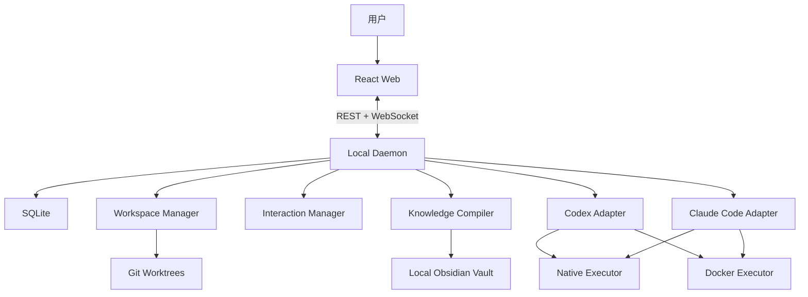
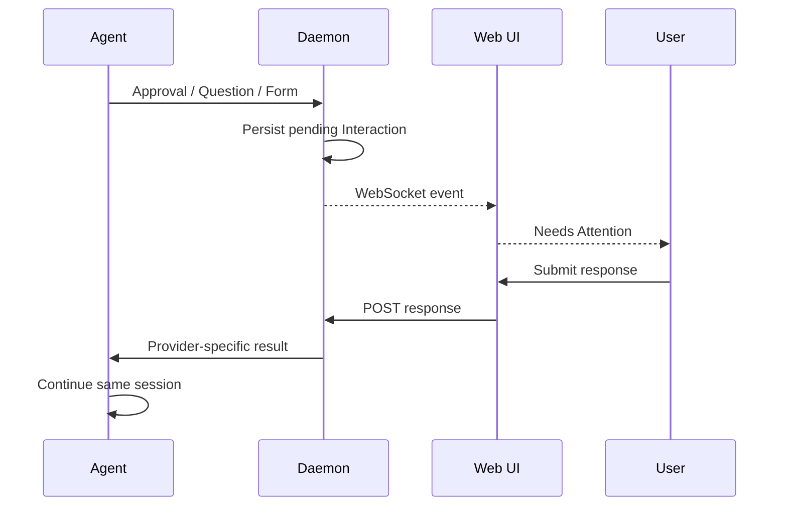

# Agents-Workspaces P0 技术方案

## 技术栈

- Node.js 22+、TypeScript；
- npm Workspaces；
- Fastify、WebSocket；
- React、Vite；
- Node.js SQLite；
- Git CLI、Docker CLI；
- Zod；
- Node Test Runner。

## 架构



Daemon 是唯一状态写入者。Web UI 不直接操作 Git、Docker 或 Agent 进程。

## 目录

```text
apps/
├── cli/
├── daemon/
└── web/
packages/
├── core/
├── database/
├── event-bus/
├── workspace-manager/
├── executor-core/
├── executor-native/
├── executor-docker/
├── agent-core/
├── agent-codex/
├── agent-claude/
├── interaction-manager/
└── knowledge-compiler/
```

## 数据模型

SQLite 保存：

- projects；
- repositories；
- tasks；
- workspaces；
- workspace_repositories；
- execution_profiles；
- agent_sessions；
- interactions；
- events。

数据库启用 WAL、Foreign Keys 和 busy timeout。Provider 原始事件以 JSON 保存，UI 使用统一领域事件。

## Workspace

Workspace Manager 使用 `git worktree add`，每个任务生成一个聚合目录：

```text
<root>/<task-id>/
├── web/
├── desktop/
├── api/
├── AGENTS.md
├── CLAUDE.md
└── .agents-workspaces/
```

创建过程会验证 Git 根目录、基线分支、目标路径和目录名。中途失败只回滚本次已创建的 Worktree。清理默认拒绝包含未提交修改的 Worktree。

## Codex Adapter

Codex 使用 `codex app-server --stdio`：

1. `initialize` / `initialized`；
2. `thread/start` 或 `thread/resume`；
3. `turn/start` / `turn/steer`；
4. 订阅 `item/*`、`turn/*`；
5. 将 App Server 的 server request 转成 Interaction；
6. 用户回答后回复原 JSON-RPC request ID。

已映射：

- `item/commandExecution/requestApproval`；
- `item/fileChange/requestApproval`；
- `item/permissions/requestApproval`；
- `item/tool/requestUserInput`；
- `mcpServer/elicitation/request`。

Codex 使用自身登录，不调用 Codex API。

## Claude Code Adapter

Claude Code 使用：

- `--input-format stream-json`；
- `--output-format stream-json`；
- HTTP Hooks；
- PermissionRequest；
- PreToolUse/AskUserQuestion；
- Elicitation；
- Stop、SessionEnd。

`AskUserQuestion` 的 PreToolUse Hook 将请求发送到 Daemon。用户回答后，Daemon 返回 `permissionDecision: allow` 和带 `answers` 的 `updatedInput`，原工具调用继续执行。

## Interaction



Interaction 使用 Provider Request ID 去重，并包含 pending、responded、resolved、stale、cancelled 状态。会话结束或 Gateway 重启后，未决请求标记 stale。

## Docker

Runner 镜像包含 Git、Codex CLI 和 Claude Code CLI。运行约束：

- 非 root；
- `--security-opt no-new-privileges:true`；
- 不使用 privileged；
- 不挂载 Docker Socket；
- 当前 Workspace 挂载到 `/workspace`；
- Codex 和 Claude Code 使用不同命名凭证卷；
- Docker Desktop 通过 `host.docker.internal` 回调本机 Hooks。

Daemon 默认监听 `0.0.0.0`，但普通 Web/API 请求仅接受 loopback 来源；这样浏览器仍为纯本机控制面，同时 Docker Desktop VM 可以到达 Claude Hook。Hook 请求必须携带进程启动时生成的 Bearer Token，Token 只通过 Agent 进程环境变量注入，不写入 SQLite 或 Obsidian。

## Obsidian

Knowledge Compiler 按以下优先级组合 Markdown：

```text
Global < Project < Repository < Task
```

输出 AGENTS.md、CLAUDE.md 和带 SHA-256 的 Context Manifest。任务结束后，知识候选写入：

```text
00 Inbox/Agent Memory Candidates/
```

## 本地启动

```bash
npm install
npm run build
npm start
```

开发模式：

```bash
npm run dev
```

Docker：

```bash
npm run docker:build
```

## 验证

```bash
npm run typecheck
npm run test
npm run build
```

自动测试覆盖状态聚合、SQLite、Git Worktree、Codex JSON-RPC 和 Claude Code stream-json Adapter。端到端烟雾测试还会验证项目、仓库、任务、Workspace、Changes、静态 Web 和安全清理 API。

## 官方协议依据

- Codex App Server：https://learn.chatgpt.com/docs/app-server
- Codex ChatGPT 计划：https://help.openai.com/en/articles/11369540-using-codex-with-your-chatgpt-plan
- Claude Code Hooks：https://code.claude.com/docs/en/hooks
- Claude Code CLI：https://code.claude.com/docs/en/cli-usage
